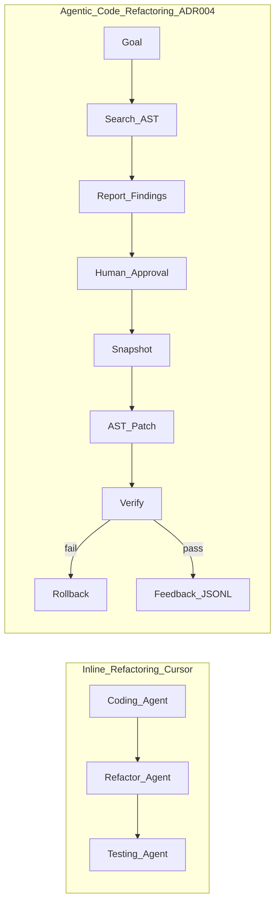

# ADR-004: AI Code Refactoring Guide — TaskFlowAI Alignment

**Status:** Implemented  
**Date:** 2026-07-16  
**Implemented:** 2026-07-16 (YOLO)

## Context

An external **AI Code Refactoring** guide defines two refactoring modes (inline vs agentic), a 10-stage agentic loop (Goal → Plan → Read → Search → Report → Human approval → Snapshot → Patch → Verify → Loop/Rollback), and implementation recommendations (AST-based deterministic patching, reinforcement-learning feedback from verification outcomes).

TaskFlowAI remains primarily a task-management platform. This ADR originally documented alignment only; an explicit request then upgraded **Future Scope** into a sandboxed runtime capability under `backend/refactoring/`.

## Decision

1. **Retain inline refactoring** in the Cursor Coding → Refactor → Testing → Docs agent workflow.
2. **Keep the existing task-AI graph** scoped to NL task drafts (consent + preview-before-apply).
3. **Implement agentic code refactoring** as an **opt-in, admin-only, sandboxed** subsystem that realizes Search, Snapshot, Patch, Verify/Rollback, and Feedback logging — without mutating the main task graph.
4. **Never apply patches without human approval of finding IDs**, and always snapshot before patch with automatic rollback on verify failure.
5. Prefer **stdlib AST transforms** for mechanical renames over LLM-guessed text edits.

## Implementation Map

| Stage | Status | Location |
|---|---|---|
| Goal / Plan | Implemented | `AgenticRefactoringService.analyze` |
| Search | Implemented | `backend/refactoring/search.py` + `search_agent_node` |
| Report | Implemented | `report_agent_node` + `RefactorFinding` |
| Human approval | Implemented | `POST /api/v1/refactoring/analyze` → `POST .../apply` with `approved_finding_ids` |
| Snapshot | Implemented | `backend/refactoring/snapshot.py` |
| Patch | Implemented | `backend/refactoring/patch.py` (AST rename) |
| Verify | Implemented | `backend/refactoring/verify.py` (`ast.parse` + optional `REFACTORING_VERIFY_COMMAND`) |
| Loop / Rollback | Implemented | restore snapshot on verify/patch failure |
| RL feedback | Implemented | JSONL `FeedbackStore` (`REFACTORING_FEEDBACK_PATH`) |

### API (feature-flagged)

- `POST /api/v1/refactoring/analyze` — Goal → Search → Report (no mutation)
- `POST /api/v1/refactoring/apply` — approved findings → Snapshot → Patch → Verify → Rollback
- `POST /api/v1/refactoring/feedback` — reject findings (accept recorded on apply)
- `GET /api/v1/refactoring/runs/{run_id}`

### Settings

| Env | Default | Purpose |
|---|---|---|
| `REFACTORING_ENABLED` | `false` | Master switch |
| `REFACTORING_SANDBOX_ROOT` | empty | Allowlisted directory jail |
| `REFACTORING_VERIFY_COMMAND` | empty | Optional post-patch command |
| `REFACTORING_FEEDBACK_PATH` | `.taskflow/refactoring-feedback.jsonl` | Accept/reject + verify log |

Guards: `WorkspaceRole.ADMIN`, AI consent (TF-051), path jail (`RefactoringSandbox`).

## Inline vs Agentic Refactoring in TaskFlowAI

## Consequences

- Engineers can run sandboxed agentic renames via API when explicitly enabled.
- Task-AI graph behavior is unchanged.
- Mechanical renames use AST (`ast.unparse`); formatting may change — prefer later lossless trees (`libcst`) if formatting fidelity becomes a requirement.
- Feedback JSONL is an improvement signal store, not automatic model fine-tuning.

## References

- [AGENT.md](../../AGENT.md)
- [.cursor/rules/refactor.mdc](../../.cursor/rules/refactor.mdc)
- [backend/refactoring/service.py](../../backend/refactoring/service.py)
- [backend/agents/refactoring/AGENT.md](../../backend/agents/refactoring/AGENT.md)
- [backend/api/v1/refactoring.py](../../backend/api/v1/refactoring.py)
- [AGENTIC-CONSENT.md](../AGENTIC-CONSENT.md)
